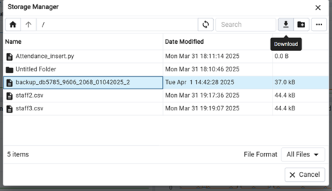

#                                                                                    Bus Company Management

##                                                                                 Driver and Staff Management

###                                                                                                              **מגישות:**   
###                                                                                                            לאה ברדוגו 341032068  
###                                                                                                           שירה קרנברג 214359606  

##  תוכן עניינים:

##### תיאור מילולי של המערכת
##### הסבר על הישויות והתכונות שלהן
##### דיאגרמת ERD
##### דיאגרמת DSD
##### הכנסת נתונים דרך קבצי אקסל
##### הכנסת נתונים דרך פייתון
##### הכנסת נתונים דרך Mockaroo
##### ביצוע גיבוי
##### ביצוע שחזור
##### שאילתות Select

## 📄 תיאור מילולי של המערכת

המערכת מיועדת לניהול עובדים, נהגים ולוחות זמנים של חברה, תוך מעקב אחר נתוני נוכחות, שכר והקצאות עבודה.  
היא מאפשרת לנהל את פרטי העובדים, לוודא שהנהגים מחזיקים ברישיונות בתוקף, ולתעד את זמני העבודה והמשמרות שלהם.

**הפונקציונליות המרכזית של המערכת כוללת:**
- ניהול פרטי עובדים (שם, טלפון, תאריך תחילת עבודה ועוד).
- מעקב אחר נוכחות יומית של עובדים.
- ניהול משכורות והוספת בונוסים.
- ניהול משמרות ולוחות זמנים של עובדים.
- הקצאת נהגים לאוטובוסים.
- מעקב אחר רישיונות נהיגה של נהגים ותוקפם.

---

## 📊 הסבר על הישויות והתכונות שלהן

### **1. עובדים (Staff)**  
מייצגת את כל העובדים בחברה.  
**תכונות:**

- `StaffID` – מזהה ייחודי לכל עובד (מפתח ראשי).
- `First_Name` – שם פרטי של העובד.
- `Last_Name` – שם משפחה של העובד.
- `Phone` – מספר טלפון של העובד.
- `Email` – כתובת דוא"ל של העובד.
- `Hire_Date` – תאריך תחילת העבודה של העובד.

---

### **2. נוכחות עובדים (Attendance)**  
מתעדת את הנוכחות היומית של כל עובד.  
**תכונות:**
- `AttendanceID` – מזהה ייחודי לכל רשומת נוכחות (מפתח ראשי).
- `currentDate` – תאריך הנוכחות.
- `Status` – סטטוס נוכחות (נוכח, נעדר, מאחר).
- `StaffID` – מזהה העובד (מפתח זר לטבלת Staff).

---

### **3. משכורות (Salary)**  
מכילה את פרטי המשכורת של העובדים.  
**תכונות:**
- `SalaryID` – מזהה ייחודי לכל משכורת (מפתח ראשי).
- `Amount` – סכום המשכורת.
- `PaymentDate` – תאריך התשלום.
- `Bonus` – בונוס נוסף (אם קיים).
- `StaffID` – מזהה העובד שקיבל את המשכורת (מפתח זר לטבלת Staff).

---

### **4. נהגים (Driver)**  
מייצגת את הנהגים בחברה (תת-קטגוריה של Staff).  
**תכונות:**
- `StaffID` – מזהה העובד שמשמש כנהג (מפתח ראשי + מפתח זר לטבלת Staff).

---

### **5. לוחות זמנים של עובדים (Schedule)**  
מתעדת את המשמרות של העובדים.  
**תכונות:**
- `ScheduleID` – מזהה ייחודי לכל משמרת (מפתח ראשי).
- `ShiftStart` – שעת התחלת המשמרת.
- `ShiftEnd` – שעת סיום המשמרת.
- `StaffID` – מזהה העובד (מפתח זר לטבלת Staff).

---

### **6. רישיון נהיגה של נהגים (DriverLicense)**  
מתעדת את רישיונות הנהיגה של הנהגים.  
**תכונות:**
- `LicenseID` – מזהה ייחודי לכל רישיון (מפתח ראשי).
- `ExpiryDate` – תאריך תפוגת הרישיון.
- `IssuedDate` – תאריך הוצאת הרישיון.
- `StaffID` – מזהה הנהג (מפתח זר לטבלת Driver).

---

### **7. הקצאת נהגים לאוטובוסים (DriverAssignment)**  
מתעדת אילו נהגים הוקצו לאילו אוטובוסים ובאילו תאריכים.  
**תכונות:**
- `AssignmentID` – מזהה ייחודי לכל הקצאה (מפתח ראשי).
- `BusID` – מזהה האוטובוס שהנהג קיבל.
- `AssignmentDate` – תאריך תחילת ההקצאה.
- `EndDate` – תאריך סיום ההקצאה (אם קיים).
- `StaffID` – מזהה הנהג שהוקצה (מפתח זר לטבלת Driver).

---
                                                                                                                                                                                                                     
                                                                                                                                                                                                                                                                                                                                                                                                                              
## **📊 דיאגרמת ERD**
.

## **📊 דיאגרמת DSD**
.

## **📥 הכנסת נתונים דרך קבצי אקסל**

## **📥 הכנסת נתונים דרך פייתון**

#### הסקריפט יצר לנו קובץ כזה:

## **📥 הכנסת נתונים דרך Mockaroo**

## **💾 ביצוע גיבוי**

## **💾 ביצוע שחזור**

---
# 📊 שאילתה 1: "היום עם הכי הרבה היעדרויות ומי הגיע בכל זאת"

## 🚌 רקע:
בחברת האוטובוסים שלנו, כל יום הוא מסע.  
אבל לפעמים… לא כל הנהגים עולים על ההגה.

לשמחתנו, המערכת שומרת נתוני משמרות, כך שנוכל לעקוב:
- מי הופיע,
- מי הבריז,
- ובאיזה יום החברה חוותה את המכה הקשה ביותר של חוסרי עובדים.

השאילתה הבאה באה לענות על שתי שאלות קריטיות:

1. **באיזה יום היו הכי הרבה היעדרויות?**
2. **מי היו העובדים שכן הופיעו באותו יום?**  
   (AKA – "מי לא גוסטינג?" 👻)

## 🔍 שימושיות:

✅ **זיהוי ימים בעייתיים** עם שיעור היעדרויות גבוה → אולי צריך לתגבר? אולי לשנות לוז?

✅ **הוקרת תודה לעובדים האחראיים** – אלה שבאו גם כשכולם הבריזו.

✅ **תכנון חכם יותר למשמרות עתידיות** – בהתבסס על דפוסי הגעה מהעבר.

---

##### תוצאה:

# 💸 שאילתה 2: "איזה חודש היה עם הבונוסים הגבוהים ביותר?"
## 🧾 רקע:
במקרים רבים, חברות מעניקות בונוסים לעובדיהם כתמריץ, ולעיתים יש לכך השפעה גדולה על המוטיבציה והביצועים.
השאילתה הזו מנתחת את חודש הבונוסים הגבוהים ביותר על פי סכום כל הבונוסים, ומציגה את העובדים שקיבלו בונוסים באותו חודש, כך שניתן להבחין מי נהנה מההטבות הגדולות ביותר.

## 🔍 שימושיות:
✅**ניתוח חודש הבונוסים** – מה החודש שבו שולם הסכום הכולל הגבוה ביותר של בונוסים?

✅**תמריצים ושימור עובדים** – חודש עם בונוסים גבוהים במיוחד יכול להצביע על תקופה של שיפור בביצועים.

✅**מעקב אחרי ביצועים** – אפשר לזהות את העובדים שהיו בתמורה לבונוסים הגבוהים ביותר ולהבין את הגורמים לכך.

✅**תכנון תמריצים עתידיים** – תכנון של בונוסים לחודשים עתידיים לפי הביצועים וההישגים.

---

##### תוצאה:

---
# 💸 שאילתה 3: "מי קיבל משכורת מעל הממוצע בחודש הנוכחי וכן מה המשכורת שלהם"

## 🚌 רקע:
בחברת האוטובוסים שלנו, חשוב לזהות מי באמת "נותן גז" 💨 ולא רק מטאפורית.
השאילתה הזו בודקת איזה עובדים קיבלו שכר מעל הממוצע של שאר העובדים – בחודש הנוכחי בלבד.
היא משלבת מידע מהטבלאות Staff ו-Salary, ומסננת את מי שבלטו לחיוב בביצועים (לפחות לפי גובה השכר!).

## 🔍 שימושיות:
✅ **זיהוי מצטיינים לתגמול או לציון לשבח** – מי שקיבלו מעל הממוצע החודשי כנראה נתנו עבודה טובה.

✅**מעקב אחרי שכר ותגמולים** – לבדוק אם מדיניות השכר תואמת את הביצועים בפועל.

✅**תובנות לניהול משאבי אנוש** – להבין אם יש דפוס חוזר של מצטיינים בחודש מסוים.

✅**שקיפות או דו"ח מנהלים** – אפשר להשתמש בתוצאה כבסיס להצגת נתונים בהנהלה או לצוות משאבי אנוש.

---

##### תוצאה:

---

# 💸 שאילתה 4: "עובדים שנכחו והיגיעו בזמן, אבל לא קבלו בונוס"
## 📚 רקע:
במערכות ניהול עובדים, לעיתים חשוב לא רק לדעת מי הגיע לעבודה, אלא גם לזהות עובדים שמגיעים בזמן אך אינם מתוגמלים בבונוס. המידע הזה יכול לעזור למנהלים להבין האם יש צורך לעדכן את מדיניות התמריצים.

## 🔍 שימושיות:
✅**זיהוי עובדים חרוצים שלא מקבלים הכרה כלכלית.**

✅**מאפשר למנהלים לבדוק האם יש צורך לעדכן תמריצים או להעריך מחדש קריטריונים לבונוסים.**

---

##### תוצאה:

# 🕓 שאילתה 5: "עובדים שהוקצו למשימת נהיגה עם רישיון שתוקפו יפוג תכף"
## 🚗 רקע:
במערכת ניהול משימות ונהגים, כל עובד שמקבל משימה הדורשת נהיגה חייב להחזיק ברישיון נהיגה בתוקף.
אבל מה קורה אם מישהו מקבל משימה, והרישיון שלו פג תוקף תוך פחות מ־90 יום?
זאת עלולה להיות בעיה בטיחותית ורגולטורית חמורה.

## 🔍 שימושיות:
✅**זיהוי עובדים בסיכון רגולטורי** – ניתן לדעת מי הולך לנהוג עם רישיון שעומד לפוג.

✅**התרעה מראש למשאבי אנוש** – כדי לחדש רישיונות בזמן.

✅**שיפור תכנון משימות** – ניתן להימנע מלהקצות משימות נהיגה לעובדים עם רישיון שעומד לפוג.

✅**עמידה בתקנות החוק** – לוודא שלא נשלחים נהגים עם רישיון לא תקף או כמעט לא תקף.

---

##### תוצאה:

---

# 🚗 שאילתה 6: "נהגים שעובדים בסופי שבוע"
## 🧠 רקע
במערכות ניהול משמרות, חשוב לפקח מי מהעובדים שובץ לעבודה בסופי שבוע (שבת וראשון). נהגים שפועלים בזמנים אלו עשויים להזדקק להטבות מיוחדות, חופשות מפצות, או פשוט להיות תחת רגולציה שונה.

## 🔍 שימושיות:
✅**לזיהוי עומס יתר בסופ"ש.**

✅**לצורכי תכנון תורנויות/משמרות.**

✅**לבדיקה אם יש צורך בגיוס נהגים נוספים.**

✅**לשימוש בדוחות HR או תיעוד תקני עבודה.**

---

##### תוצאה:

---
# ⏱️ שאילתה 7: "עובדים שלא שובצו למשמרות בחצי השנה האחרונה אך עדיין מקבלים שכר"

## 📚 רקע:
במערכות שכר וניהול עובדים, חשוב לוודא שהתשלומים נעשים לעובדים פעילים בלבד. אבל לפעמים, בגלל טעויות או נסיבות מיוחדות, קורה שעובד ממשיך לקבל שכר – גם אם לא שובץ למשמרות כבר תקופה.
השאילתה הזו בודקת בדיוק את המצב הזה.

## 🔍 שימושיות:

✅**זיהוי תשלומים חריגים לעובדים שלא עובדים בפועל.**

✅**חיסכון בעלויות שכר על ידי איתור תשלומים מיותרים.**

✅**ביקורת פנימית כדי למנוע הונאות או רשלנות.**

---

##### תוצאה:

# ⏱️ שאילתה 8: "מי עבד את המשמרת הכי ארוכה השנה?"
## 🚌 רקע
במערכות ניהול עובדים, מעקב אחרי משך המשמרות של כל עובד הוא מידע חיוני – במיוחד כשמדובר במשרות שדורשות ריכוז ובטיחות כמו תחבורה.
השאילתה הזו עוזרת לנו לנתח מי מהעובדים עבד משמרות ארוכות במיוחד בשנה הנוכחית – מידע שיכול להאיר על עייפות, שחיקה או צורך בבונוס 😉.

## 🔍 שימושיות:
✅**בדיקת עומס עבודה אישי** – מי מהעובדים נשחק הכי הרבה?

✅**מעקב על חריגות** – האם מישהו עבר את מגבלת שעות העבודה החוקית?

✅**קבלת החלטות על תגמולים** – מי ראוי לתוספת על השקעה יוצאת דופן?

✅**שיפור שיבוץ עתידי** – איזון טוב יותר בין עובדים במשמרות ארוכות וקצרות.

---

##### תוצאה:

---

