#                                                                                    Bus Company Management

##                                                                                 Driver and Staff Management

###                                                                                                              **מגישות:**   
###                                                                                                            לאה ברדוגו 341032068  
###                                                                                                           שירה קרנברג 214359606  


##  תוכן עניינים:

##### תיאור מילולי של המערכת
##### הסבר על הישויות והתכונות שלהן
##### דיאגרמת ERD
##### דיאגרמת DSD
##### הכנסת נתונים דרך קבצי אקסל
##### הכנסת נתונים דרך פייתון
##### הכנסת נתונים דרך Mockaroo
##### ביצוע גיבוי
##### ביצוע שחזור
##### שאילתות Select
##### שאילתות Update
##### שאילתות Delete
##### אילוצים 
##### ביצוע Rollback
##### ביצוע Commit
##### תרשים DSD של בסיס הנתונים השני
##### תרשים ERD של בסיס הנתונים השני
##### תרשים ERD משותף של שני הבסיסי נתונים 
##### תרשים DSD משותף של שני הבסיסי נתונים 
##### החלטות שנעשו בשלב האינטגרציה 
#####  הסבר מילולי של התהליך והפקודות של שלב האינטגרציה 
#####  מבט 1- BusRouteDetailsView 
#####  מבט 2- DriverBusAssignments


## 📄 תיאור מילולי של המערכת

המערכת מיועדת לניהול עובדים, נהגים ולוחות זמנים של חברה, תוך מעקב אחר נתוני נוכחות, שכר והקצאות עבודה.  
היא מאפשרת לנהל את פרטי העובדים, לוודא שהנהגים מחזיקים ברישיונות בתוקף, ולתעד את זמני העבודה והמשמרות שלהם.

**הפונקציונליות המרכזית של המערכת כוללת:**
- ניהול פרטי עובדים (שם, טלפון, תאריך תחילת עבודה ועוד).
- מעקב אחר נוכחות יומית של עובדים.
- ניהול משכורות והוספת בונוסים.
- ניהול משמרות ולוחות זמנים של עובדים.
- הקצאת נהגים לאוטובוסים.
- מעקב אחר רישיונות נהיגה של נהגים ותוקפם.

---

## 📊 הסבר על הישויות והתכונות שלהן

### **1. עובדים (Staff)**  
מייצגת את כל העובדים בחברה.  
**תכונות:**

- `StaffID` – מזהה ייחודי לכל עובד (**מפתח ראשי**).
- `First_Name` – שם פרטי של העובד.
- `Last_Name` – שם משפחה של העובד.
- `Phone` – מספר טלפון של העובד.
- `Email` – כתובת דוא"ל של העובד.
- `Hire_Date` – תאריך תחילת העבודה של העובד.

---

### **2. נוכחות עובדים (Attendance)**  
מתעדת את הנוכחות היומית של כל עובד.  
**תכונות:**
- `AttendanceID` – מזהה ייחודי לכל רשומת נוכחות (מפתח ראשי).
- `currentDate` – תאריך הנוכחות.
- `Status` – סטטוס נוכחות (נוכח, נעדר, מאחר).
- `StaffID` – מזהה העובד (מפתח זר לטבלת Staff).

---

### **3. משכורות (Salary)**  
מכילה את פרטי המשכורת של העובדים.  
**תכונות:**
- `SalaryID` – מזהה ייחודי לכל משכורת (מפתח ראשי).
- `Amount` – סכום המשכורת.
- `PaymentDate` – תאריך התשלום.
- `Bonus` – בונוס נוסף (אם קיים).
- `StaffID` – מזהה העובד שקיבל את המשכורת (מפתח זר לטבלת Staff).

---

### **4. נהגים (Driver)**  
מייצגת את הנהגים בחברה (תת-קטגוריה של Staff).  
**תכונות:**
- `StaffID` – מזהה העובד שמשמש כנהג (מפתח ראשי + מפתח זר לטבלת Staff).

---

### **5. לוחות זמנים של עובדים (Schedule)**  
מתעדת את המשמרות של העובדים.  
**תכונות:**
- `ScheduleID` – מזהה ייחודי לכל משמרת (מפתח ראשי).
- `ShiftStart` – שעת התחלת המשמרת.
- `ShiftEnd` – שעת סיום המשמרת.
- `StaffID` – מזהה העובד (מפתח זר לטבלת Staff).

---

### **6. רישיון נהיגה של נהגים (DriverLicense)**  
מתעדת את רישיונות הנהיגה של הנהגים.  
**תכונות:**
- `LicenseID` – מזהה ייחודי לכל רישיון (מפתח ראשי).
- `ExpiryDate` – תאריך תפוגת הרישיון.
- `IssuedDate` – תאריך הוצאת הרישיון.
- `StaffID` – מזהה הנהג (מפתח זר לטבלת Driver).

---

### **7. הקצאת נהגים לאוטובוסים (DriverAssignment)**  
מתעדת אילו נהגים הוקצו לאילו אוטובוסים ובאילו תאריכים.  
**תכונות:**
- `AssignmentID` – מזהה ייחודי לכל הקצאה (מפתח ראשי).
- `BusID` – מזהה האוטובוס שהנהג קיבל.
- `AssignmentDate` – תאריך תחילת ההקצאה.
- `EndDate` – תאריך סיום ההקצאה (אם קיים).
- `StaffID` – מזהה הנהג שהוקצה (מפתח זר לטבלת Driver).

---
                                                                                                                                                                                                                     
                                                                                                                                                                                                                                                                                                                                                                                                                              
## **📊 דיאגרמת ERD**
.


## **📊 דיאגרמת DSD**
.


## **📥 הכנסת נתונים דרך קבצי אקסל**


## **📥 הכנסת נתונים דרך פייתון**
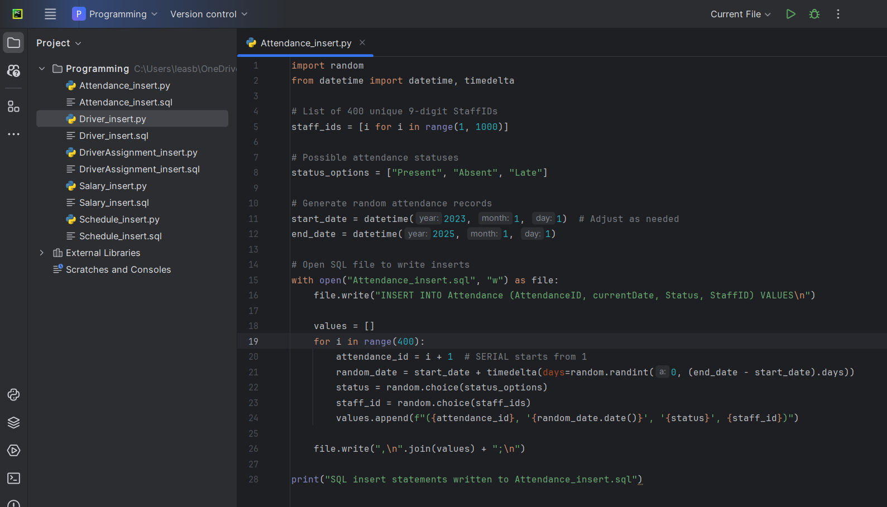
#### הסקריפט יצר לנו קובץ כזה:


## **📥 הכנסת נתונים דרך Mockaroo**

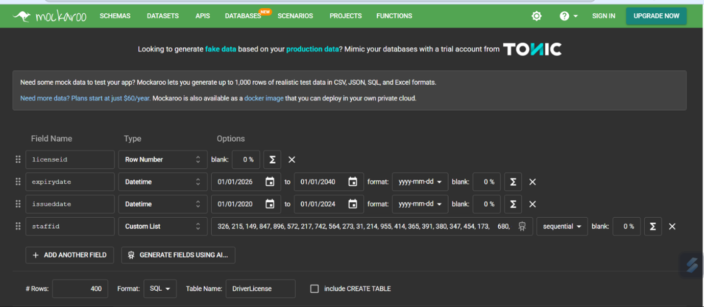


## **💾 ביצוע גיבוי**


## **💾 ביצוע שחזור**


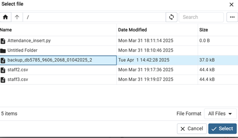


---
# 📊 שאילתה 1: "היום עם הכי הרבה היעדרויות ומי הגיע בכל זאת"

## 🚌 רקע:
בחברת האוטובוסים שלנו, כל יום הוא מסע.  
אבל לפעמים… לא כל הנהגים עולים על ההגה.

לשמחתנו, המערכת שומרת נתוני משמרות, כך שנוכל לעקוב:
- מי הופיע,
- מי הבריז,
- ובאיזה יום החברה חוותה את המכה הקשה ביותר של חוסרי עובדים.

השאילתה הבאה באה לענות על שתי שאלות קריטיות:

1. **באיזה יום היו הכי הרבה היעדרויות?**
2. **מי היו העובדים שכן הופיעו באותו יום?**  
   (AKA – "מי לא גוסטינג?" 👻)


## 🔍 שימושיות:

✅ **זיהוי ימים בעייתיים** עם שיעור היעדרויות גבוה → אולי צריך לתגבר? אולי לשנות לוז?

✅ **הוקרת תודה לעובדים האחראיים** – אלה שבאו גם כשכולם הבריזו.

✅ **תכנון חכם יותר למשמרות עתידיות** – בהתבסס על דפוסי הגעה מהעבר.

---


##### תוצאה:


# 💸 שאילתה 2: "איזה חודש היה עם הבונוסים הגבוהים ביותר?"
## 🧾 רקע:
במקרים רבים, חברות מעניקות בונוסים לעובדיהם כתמריץ, ולעיתים יש לכך השפעה גדולה על המוטיבציה והביצועים.
השאילתה הזו מנתחת את חודש הבונוסים הגבוהים ביותר על פי סכום כל הבונוסים, ומציגה את העובדים שקיבלו בונוסים באותו חודש, כך שניתן להבחין מי נהנה מההטבות הגדולות ביותר.

## 🔍 שימושיות:
✅**ניתוח חודש הבונוסים** – מה החודש שבו שולם הסכום הכולל הגבוה ביותר של בונוסים?

✅**תמריצים ושימור עובדים** – חודש עם בונוסים גבוהים במיוחד יכול להצביע על תקופה של שיפור בביצועים.

✅**מעקב אחרי ביצועים** – אפשר לזהות את העובדים שהיו בתמורה לבונוסים הגבוהים ביותר ולהבין את הגורמים לכך.

✅**תכנון תמריצים עתידיים** – תכנון של בונוסים לחודשים עתידיים לפי הביצועים וההישגים.


---

##### תוצאה:


---
# 💸 שאילתה 3: "מי קיבל משכורת מעל הממוצע בחודש הנוכחי וכן מה המשכורת שלהם"

## 🚌 רקע:
בחברת האוטובוסים שלנו, חשוב לזהות מי באמת "נותן גז" 💨 ולא רק מטאפורית.
השאילתה הזו בודקת איזה עובדים קיבלו שכר מעל הממוצע של שאר העובדים – בחודש הנוכחי בלבד.
היא משלבת מידע מהטבלאות Staff ו-Salary, ומסננת את מי שבלטו לחיוב בביצועים (לפחות לפי גובה השכר!).

## 🔍 שימושיות:
✅ **זיהוי מצטיינים לתגמול או לציון לשבח** – מי שקיבלו מעל הממוצע החודשי כנראה נתנו עבודה טובה.

✅**מעקב אחרי שכר ותגמולים** – לבדוק אם מדיניות השכר תואמת את הביצועים בפועל.

✅**תובנות לניהול משאבי אנוש** – להבין אם יש דפוס חוזר של מצטיינים בחודש מסוים.

✅**שקיפות או דו"ח מנהלים** – אפשר להשתמש בתוצאה כבסיס להצגת נתונים בהנהלה או לצוות משאבי אנוש.

---

##### תוצאה:


---

# 💸 שאילתה 4: "עובדים שנכחו והיגיעו בזמן, אבל לא קבלו בונוס"
## 📚 רקע:
במערכות ניהול עובדים, לעיתים חשוב לא רק לדעת מי הגיע לעבודה, אלא גם לזהות עובדים שמגיעים בזמן אך אינם מתוגמלים בבונוס. המידע הזה יכול לעזור למנהלים להבין האם יש צורך לעדכן את מדיניות התמריצים.

## 🔍 שימושיות:
✅**זיהוי עובדים חרוצים שלא מקבלים הכרה כלכלית.**

✅**מאפשר למנהלים לבדוק האם יש צורך לעדכן תמריצים או להעריך מחדש קריטריונים לבונוסים.**

---


##### תוצאה:


# 🕓 שאילתה 5: "עובדים שהוקצו למשימת נהיגה עם רישיון שתוקפו יפוג תכף"
## 🚗 רקע:
במערכת ניהול משימות ונהגים, כל עובד שמקבל משימה הדורשת נהיגה חייב להחזיק ברישיון נהיגה בתוקף.
אבל מה קורה אם מישהו מקבל משימה, והרישיון שלו פג תוקף תוך פחות מ־90 יום?
זאת עלולה להיות בעיה בטיחותית ורגולטורית חמורה.

## 🔍 שימושיות:
✅**זיהוי עובדים בסיכון רגולטורי** – ניתן לדעת מי הולך לנהוג עם רישיון שעומד לפוג.

✅**התרעה מראש למשאבי אנוש** – כדי לחדש רישיונות בזמן.

✅**שיפור תכנון משימות** – ניתן להימנע מלהקצות משימות נהיגה לעובדים עם רישיון שעומד לפוג.

✅**עמידה בתקנות החוק** – לוודא שלא נשלחים נהגים עם רישיון לא תקף או כמעט לא תקף.

---

##### תוצאה:


---

# 🚗 שאילתה 6: "נהגים שעובדים בסופי שבוע"
## 🧠 רקע
במערכות ניהול משמרות, חשוב לפקח מי מהעובדים שובץ לעבודה בסופי שבוע (שבת וראשון). נהגים שפועלים בזמנים אלו עשויים להזדקק להטבות מיוחדות, חופשות מפצות, או פשוט להיות תחת רגולציה שונה.

## 🔍 שימושיות:
✅**לזיהוי עומס יתר בסופ"ש.**

✅**לצורכי תכנון תורנויות/משמרות.**

✅**לבדיקה אם יש צורך בגיוס נהגים נוספים.**

✅**לשימוש בדוחות HR או תיעוד תקני עבודה.**

---

##### תוצאה:


---
# ⏱️ שאילתה 7: "עובדים שלא שובצו למשמרות בחצי השנה האחרונה אך עדיין מקבלים שכר"

## 📚 רקע:
במערכות שכר וניהול עובדים, חשוב לוודא שהתשלומים נעשים לעובדים פעילים בלבד. אבל לפעמים, בגלל טעויות או נסיבות מיוחדות, קורה שעובד ממשיך לקבל שכר – גם אם לא שובץ למשמרות כבר תקופה.
השאילתה הזו בודקת בדיוק את המצב הזה.

## 🔍 שימושיות:

✅**זיהוי תשלומים חריגים לעובדים שלא עובדים בפועל.**

✅**חיסכון בעלויות שכר על ידי איתור תשלומים מיותרים.**

✅**ביקורת פנימית כדי למנוע הונאות או רשלנות.**

---

##### תוצאה:


# ⏱️ שאילתה 8: "מי עבד את המשמרת הכי ארוכה השנה?"
## 🚌 רקע
במערכות ניהול עובדים, מעקב אחרי משך המשמרות של כל עובד הוא מידע חיוני – במיוחד כשמדובר במשרות שדורשות ריכוז ובטיחות כמו תחבורה.
השאילתה הזו עוזרת לנו לנתח מי מהעובדים עבד משמרות ארוכות במיוחד בשנה הנוכחית – מידע שיכול להאיר על עייפות, שחיקה או צורך בבונוס 😉.

## 🔍 שימושיות:
✅**בדיקת עומס עבודה אישי** – מי מהעובדים נשחק הכי הרבה?

✅**מעקב על חריגות** – האם מישהו עבר את מגבלת שעות העבודה החוקית?

✅**קבלת החלטות על תגמולים** – מי ראוי לתוספת על השקעה יוצאת דופן?

✅**שיפור שיבוץ עתידי** – איזון טוב יותר בין עובדים במשמרות ארוכות וקצרות.

---

##### תוצאה:


---

# 💸 שאילתת עדכון 1: עדכון בונוס חודשי לעובדים בעלי נוכחות מלאה
מטרת השאילתה היא לעדכן את שדה הבונוס (Bonus) בטבלת המשכורות (Salary) של עובדים שנכחו בעבודה לפחות 15 ימים בחודש הנוכחי.
החברה מגדירה 15 ימי עבודה כחודש עבודה מלא, ולכן עובדים שהגיעו לכל הימים האלו זכאים לבונוס.


### לפני הרצת שאילתת העדכון:


### שאילתת העדכון:


### אחרי הרצת שאילתת העדכון:


---
# 🛠️שאילתת עדכון 2: עדכון אוטומטי לשעת סיום משמרת חסרה 
במקרים בהם שעת הסיום של משמרת לא הוזנה בטעות (נשמרה כ־NULL), השאילתה הזו מתקנת את הנתונים על ידי קביעת שעת סיום שהיא 8 שעות לאחר שעת התחלה.
העדכון מתבצע רק עבור משמרות שהחלו בעבר (תאריך המשמרת קטן מהתאריך הנוכחי).


### לפני הרצת שאילתת העדכון:


### שאילתת העדכון:
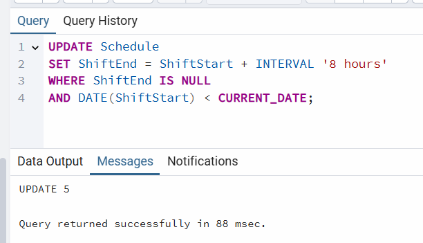

### אחרי הרצת שאילתת העדכון:


---

# 🛠️ שאילתת עדכון 3: קיצוץ שכר לעובדים שמאחרים לעיתים תכופות
השאילתה מזהה עובדים שאיחרו יותר מ־3 פעמים במהלך החודש האחרון, ומבצעת קיצוץ אוטומטי של 100 ש"ח מהשכר שלהם.
המטרה היא לעודד עמידה בזמנים ולשפר את המשמעת בארגון.

### לפני הרצת שאילתת העדכון:


### שאילתת העדכון:
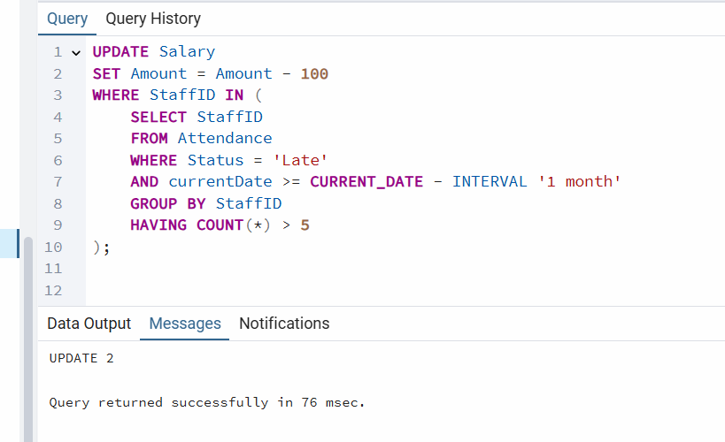

### אחרי הרצת שאילתת העדכון:


---
# 🛠️ שאילתת מחיקה 1: מחיקת עובדים שלא הופיעו לעבודה בחודש האחרון
השאילתה מוחקת את העובדים שלא היו נוכחים אפילו פעם אחת במהלך 30 הימים האחרונים, על מנת לשמור על רשומות עובדים עדכניות בלבד.

### לפני הרצת שאילתת המחיקה:


### שאילתת המחיקה:


### אחרי הרצת שאילתת המחיקה:


---

# 🔴  שאילתת מחיקה 2: מחיקת נהגים בעלי רישיון נהיגה שפג תוקפו
שאילתה זו מוחקת את כל הנהגים שהרישיון שלהם פג תוקף. כלומר, נהגים שרישיון הנהיגה שלהם אינו בתוקף עוד — נמחקים מהמערכת.

### לפני הרצת שאילתת המחיקה:


### שאילתת המחיקה:


### אחרי הרצת שאילתת המחיקה:


---

# ⏱️  שאילתת מחיקה 3: מחיקת הקצאות של נהגים עם רישיון לא בתוקף
השאילתה הזו נועדה לשמור על חוקיות ובטיחות במערכת — היא מוחקת הקצאות של נהגים לאוטובוסים כאשר הרישיון של הנהג כבר לא בתוקף בתאריך שבו הוקצה לו לבצע את הנסיעה.

### לפני הרצת שאילתת המחיקה:


### שאילתת המחיקה:
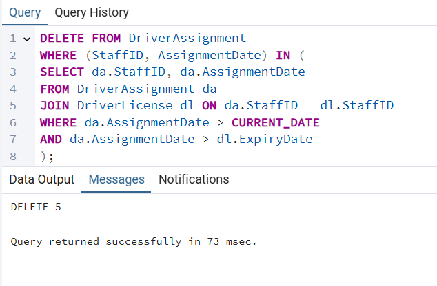


### אחרי הרצת שאילתת המחיקה:


---
# 🔒אילוץ 1: בדיקה שערך המשכורת חיובי
הוספת אילוץ שמבטיח שערך בעמודת Amount בטבלת Salary יהיה תמיד גדול מ־0.
זה מונע הזנת משכורת שלילית בטעות.
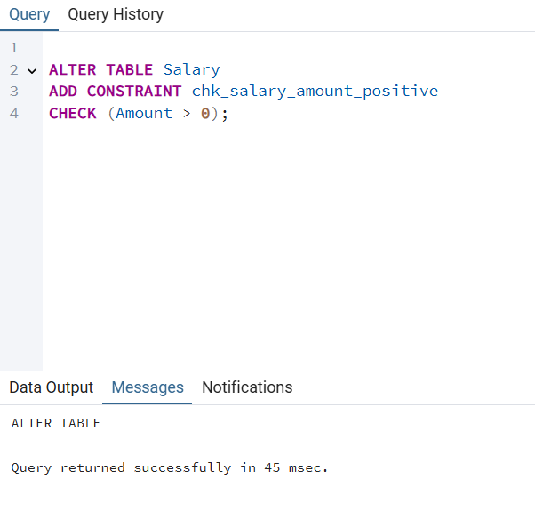

### אחרי הרצת האילוץ, כשאנסה להכניס Salary עם סכום שלילי, זה לא יעבוד:


---

 # 🔒אילוץ 2: בדיקת תוקף תאריך הרישיון
האילוץ מוודא שתאריך הפקיעה (ExpiryDate) של רישיון הנהיגה תמיד יהיה אחרי תאריך ההנפקה (IssuedDate).
כך מונעים טעויות שבהן תאריך הפקיעה מוקדם או שווה לתאריך ההנפקה — מה שלא הגיוני.


### אחרי הרצת האילוץ, כשאנסה להכניס Driver License עם תאריך הפקיעה שהוא קודם לתאריך ההנפקה, זה לא יעבוד:


---

 # 🔒אילוץ 3:  בדיקת תקינות זמני משמרת
 אילוץ זה מוודא שזמן סיום משמרת תמיד יהיה אחרי זמן התחלה.
כך נמנעות טעויות לוגיות, כמו משמרת שנגמרת לפני שהתחילה.


### אחרי הרצת האילוץ, כשאנסה להכניס Schedule שיהיה בו סוף המשמרת לפני תחילתה, זה לא יעבוד:


---

# 🔒אילוץ 4: בדיקת תאריכי שיבוץ נהג
האילוץ מוודא שבטבלת DriverAssignment, תאריך הסיום (EndDate) של שיבוץ נהג, אם קיים, חייב להיות מאוחר יותר מתאריך תחילת השיבוץ (AssignmentDate).


### אחרי הרצת האילוץ, כשאנסה להכניס Driver Assignment עם תאריך סיום לפני תאריך התחלה, זה לא יעבוד:


---


# 🔒אילוץ 5: אימות תאריך קליטה לעבודה
האילוץ מחייב שאת עמודת Hire_Date בטבלת Staff ניתן להזין רק עם תאריך שאינו עתידי—כלומר קטן או שווה להיום (CURRENT_DATE).
כך נמנעים משגיאה שבה מקלידים בטעות תאריך קליטה שנמצא בעתיד.


### אחרי הרצת האילוץ, כשאנסה להכניס Staff  עם תאריך קליטה בעתיד, זה לא יעבוד:


---


#  Rollback

נעדכן פה את הבונוס של עובדים שעבדו בחברה יותר משנה להיות 2000.
### כאו רואים שהבונוס של כולם שונה וnull  לפעמים:


### נעדכן את הבונוס להיות 2000:


### כאו רואים את העדכון של הבונוס בכל העובדים שעבדו יותר משנה בחברה:


### נבצע Rollback:


### אחרי ביצוע Rollback, כל הבונוסים חזרו להיות כמו לפני העדכון:


---
# Commit

נעדכן פה את הבונוס של עובדים שעבדו בחברה יותר משנה להיות 2000.
### כאו רואים שהבונוס של כולם שונה וnull  לפעמים:


### נעדכן את הבונוס להיות 2000:


### כאו רואים את העדכון של הבונוס בכל העובדים שעבדו יותר משנה בחברה:


### נבצע Commit:


### אחרי ביצוע Commit, כל הבונוסים נשארו כפי שהיו:


---
# תרשים DSD של בסיס הנתונים השני:


---
# תרשים ERD של בסיס הנתונים השני:


---


# תרשים ERD משותף של שני הבסיסי נתונים :


---


# תרשים DSD משותף של שני הבסיסי נתונים :
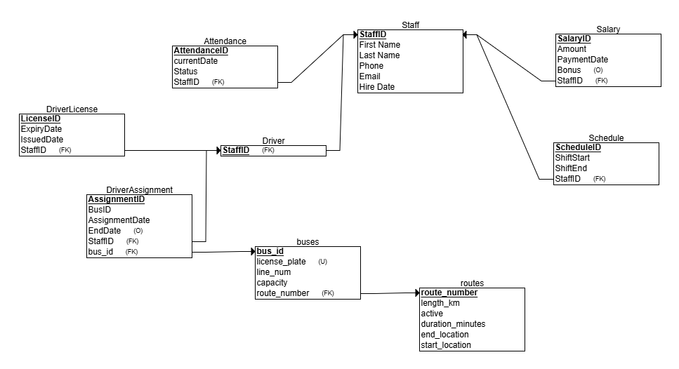

---
# החלטות שנעשו בשלב האינטגרציה :

בשלב האינטגרציה חיברנו בין טבלאות תחבורה (buses, routes) לבין טבלאות ניהול כוח אדם- (Staff, Driver, DriverAssignment, DriverLicense, Schedule, Attendance, Salary) במטרה ליצור בסיס נתונים מאוחד ושלם. אינטגרציה זו מאפשרת מעקב מדויק אחר שיבוץ נהגים לאוטובוסים ולמסלולים, ניהול זמני משמרות, נוכחות, שכר ורישיון נהיגה – והכול תחת מערכת אחת אחידה ומקושרת. במהלך תהליך זה התקבלו מספר החלטות תכנוניות חשובות, כגון:

####  שימוש ב־Foreign Keys לקישור בין ישויות:
קישרנו את DriverAssignment.BusID אל buses.bus_id.
הקשר העיקרי שבוצע באינטגרציה הוא בין DriverAssignment.BusID לבין buses.bus_id.
חיבור זה מאפשר לדעת איזה נהג שובץ לאיזה אוטובוס, וכך לחבר בין צוות הנהגים לבין מערך התחבורה.

---


#  הסבר מילולי של התהליך והפקודות של שלב האינטגרציה :

### מטרה: 
להתחבר מבסיס נתונים אחד לבסיס נתונים שני, כדי לבצע אינטגרציה של טבלאות כמו routes ו־buses — בלי להעתיק נתונים, אלא לקרוא אותם מרחוק. זה חוסך שכפול מידע.

### 1. הפעלת ההרחבה postgres_fdw
 #### CREATE EXTENSION postgres_fdw;

 הרחבה זו מאפשרת לPostgres לתקשר עם בסיסי נתונים חיצוניים מסוג PostgreSQL.

 
---


 ### 2. יצירת Foreign Data Wrapper

 -- Create a Foreign Data Wrapper named 'my_fdw' with handler and validator functions
#### CREATE FOREIGN DATA WRAPPER my_fdw
#### HANDLER postgres_fdw_handler
#### VALIDATOR postgres_fdw_validator;

יצירת "עטיפת נתונים" שתפקידה לטפל בתקשורת עם הנתונים החיצוניים.


---


 ### 3. הגדרת שרת חיצוני (Foreign Server)
 -- Define the foreign server connection details to the remote PostgreSQL database
#### SERVER foreign_server
#### FOREIGN DATA WRAPPER postgres_fdw
#### OPTIONS (host 'localhost', -- Hostname of the foreign server
 #### dbname 'fpostgres' , -- Database name on the foreign server
  #### port '5432' -- Port number for connection
  #### )
 מגדירים את פרטי החיבור למסד הנתונים שמכיל את טבלאות התחבורה.


---


 ### 4. יצירת מיפוי משתמש (User Mapping)
 -- Create a user mapping for the current user to authenticate on the foreign server
#### CREATE USER MAPPING FOR current_user
#### SERVER	foreign_server
#### OPTIONS (user 'postgres' , -- Username for the foreign server
#### password 'dbdocker12' -- Password for the foreign user
 #### )

 מאפשר למשתמש במערכת הראשית לגשת למסד החיצוני עם הרשאות מתאימות.

 ---


 ### 5. יצירת טבלה מקומית ל־routes
 -- Create a local table 'routes' in the current database to store route data
#### CREATE TABLE routes (
####    route_number INT PRIMARY KEY, -- Unique identifier for the route
####    length_km DECIMAL(5,2),              -- Route length in kilometers with two decimals
####    duration_minutes INT,                -- Duration of the route in minutes
####    start_location VARCHAR(100), -- Starting location name
####    end_location VARCHAR(100), -- Ending location name
####    active BOOLEAN DEFAULT TRUE -- Indicates if the route is currently active
#### );

יוצרים טבלה אצלנו במסד המקומי ששומרת מידע על קווי תחבורה.
הטבלה מחזיקה את כל הפרטים החשובים על הקווים — מזהה, אורך, משך, התחלה, סיום, ומצב פעילות.

---


 ### 6. יצירת טבלה מקומית ל־buses
 -- Create a local table 'buses' in the current database to store bus data
#### CREATE TABLE buses (
####    bus_id INT PRIMARY KEY, -- Unique identifier for the bus
####    route_number INT,            -- Foreign key referencing the route number       
####    license_plate VARCHAR(30) UNIQUE NOT NULL, -- Unique bus license plate number
####    line_num INT,  -- Bus line number
####    capacity INT CHECK (capacity > 0), -- Capacity of the bus, must be positive
####    FOREIGN KEY (route_number) REFERENCES routes(route_number) 
#### );
 
 יוצרים טבלה שמאגדת את פרטי האוטובוסים.
העמודה route_number היא מפתח זר שמצביע על מזהה המסלול בטבלה routes – כלומר, כל אוטובוס שייך למסלול תחבורה מסוים.


---


 ### 7. יצירת טבלה זרה (Foreign Table) ל־routes
 -- Create a foreign table 'foreign_routes' that maps to the 'routes' table on the foreign server
#### CREATE FOREIGN TABLE foreign_routes (
####    route_number INT  ,  -- Route number column from the foreign table
####    length_km DECIMAL(5,2),         -- Length in km from the foreign table   
####    duration_minutes INT,           -- Duration in minutes from the foreign table    
####   start_location VARCHAR(100), -- Starting location from the foreign table
####    end_location VARCHAR(100),  -- Ending location from the foreign table
####    active BOOLEAN DEFAULT TRUE -- Active status from the foreign table
#### )

#### SERVER foreign_server -- Specifies the foreign server to connect to
#### OPTIONS (schema_name 'public' ,  -- Schema name where the foreign table resides
#### table_name 'routes'  -- Foreign table name in the remote database
#### );
 
זו טבלה וירטואלית שמייצגת את הטבלה routes שנמצאת במסד הנתונים המרוחק (השרת החיצוני).
כל פניה ל־foreign_routes תשלח בעצם שאילתה למסד המרוחק ותחזיר את התוצאות כאילו הן אצלנו.
כך אפשר לגשת לנתונים בזמן אמת, בלי להעתיק אותם.


---


 
  ### 8. יצירת טבלה זרה (Foreign Table) ל־buses
  -- Create a foreign table 'foreign_buses' that maps to the 'buses' table on the foreign server
#### CREATE FOREIGN TABLE foreign_buses (
####    bus_id INT , -- Bus ID from the foreign table
####    route_number INT,                -- Route number from the foreign table   
####    license_plate VARCHAR(30) ,  -- License plate from the foreign table
####    line_num INT,  -- Line number from the foreign table
####    capacity INT CHECK (capacity > 0)  -- Capacity with a constraint that it must be positive
####   )

#### SERVER foreign_server -- Specifies the foreign server to connect to
#### OPTIONS (schema_name 'public' , -- Schema name where the foreign table resides
 #### table_name 'buses' -- Foreign table name in the remote database
 #### );

כמו הקודם, טבלה וירטואלית שמייצגת את טבלת buses במסד המרוחק.
מאפשרת לנו לקרוא את טבלאות האוטובוסים שנמצאות במקום אחר, בלי שכפול.

---

#  מבט 1- BusRouteDetailsView

### תיאור
המבט BusRouteDetailsView מציג את פרטי האוטובוסים והמסלולים שלהם, על ידי הצטרפות (JOIN) של טבלת foreign_buses עם foreign_routes לפי route_number. זה נותן תמונה שלמה על כל אוטובוס – מהמספר והקיבולת שלו, ועד נקודת ההתחלה והסיום של המסלול שאליו הוא שייך.

### שאילתת יצירת המבט
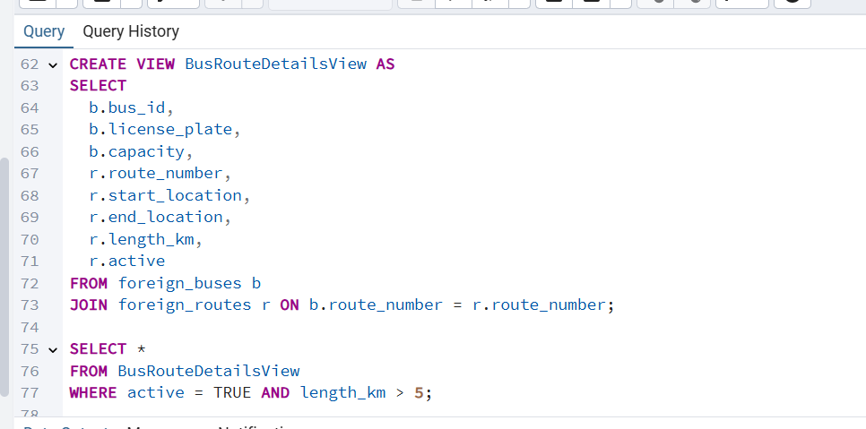

##### שליפת נתונים מהטבלה:


### שאילתא 1 על המבט
מציגה רק את האוטובוסים הפעילים (active) שהמסלול שלהם ארוך מ־5 ק"מ. כלומר – רק ריצות אמיתיות, לא תחנות קצרות בעיר


##### תוצאה:


--- 

### שאילתא 2 על המבט
השאילתה בודקת שיבוצים של נהגים לאוטובוסים בטבלה DriverBusAssignments, ומחזירה רק את אותם שיבוצים שבהם:
לשיבוץ יש תאריך סיום (EndDate IS NOT NULL)
משך השיבוץ היה יותר מ-10 ימים

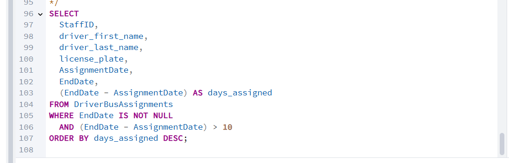

##### תוצאה:


--- 
#  מבט 2- DriverBusAssignments
### תיאור
המבט DriverBusAssignments מציג את שיוך הנהגים לאוטובוסים, כולל שמות הנהגים, מספר רכב, ותאריכי ההשמה.
המבט עושה הצטרפות בין טבלת DriverAssignment, foreign_buses (לפרטי האוטובוס), ו־Staff (כדי לקבל את שמות הנהגים).

### שאילתת יצירת המבט
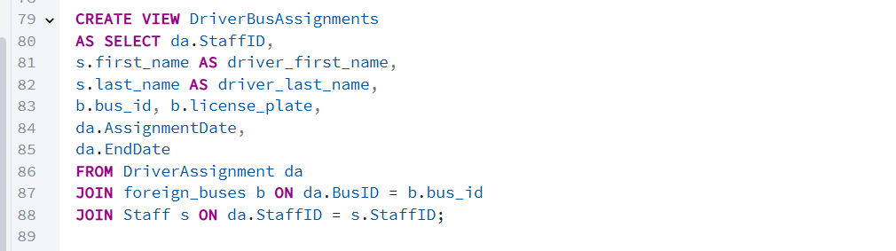

##### שליפת נתונים מהטבלה:


### שאילתא 1 על המבט
שולפת רק את השיבוצים של נהג בשם "kuku washere" .
אם הוא לא באמת קיים – הפלט יהיה ריק.


##### תוצאה:


---


### שאילתא 2 על המבט
השאילתה מחזירה את המסלול הארוך ביותר הפעיל מכל תחנת מוצא (start_location) מתוך תצוגת הנתונים BusRouteDetailsView


##### תוצאה:


---


# תוכנית ראשית 1- main_driver_performance_analysis

### תיאור מילולי של התוכנית:
התוכנית הראשית מבצעת ניתוח ביצועים של נהגים עבור חודש ושנה מסוימים. היא פועלת כך:

1. מגדירה את טווח התאריכים לפי החודש והשנה שהוזנו (או החודש הנוכחי כברירת מחדל).
2. שולפת את רשימת הנהגים עם פרטי ההקצאות שלהם (כולל סטטוס – פעיל, עתידי, או הסתיים).
3. עוברת נהג-נהג:
    * אם הנהג מוגדר כ"פעיל" – מחשבת את סך המשכורת והבונוסים שקיבל באותו חודש.
    * בודקת אם מגיע לו הארכת הקצאה – רק אם עבד הרבה (יותר מ-15 תשלומים) וקיבל שכר גבוה (מעל 50,000).
אם כן – מאריכה אוטומטית את ההקצאה שלו.
4. בסוף התהליך, מדווחת כמה נהגים נבדקו וכמה מהם היו פעילים.

###  פרוצדורות ופונקציות:

#### פונקציה 1: calculate_driver_total_salary

``` sql 
CREATE OR REPLACE FUNCTION calculate_driver_total_salary(
    p_staff_id INT,
    p_start_date DATE DEFAULT NULL,
    p_end_date DATE DEFAULT NULL
) RETURNS TABLE(
    staff_id INT,
    driver_name TEXT,
    total_salary NUMERIC,
    total_bonus NUMERIC,
    payment_count INT,
    avg_salary NUMERIC
) AS $$
DECLARE
    v_driver_record RECORD;
    v_salary_cursor CURSOR(driver_id INT, start_dt DATE, end_dt DATE) FOR
        SELECT s.amount, s.bonus, s.paymentdate 
        FROM salary s 
        WHERE s.staffid = driver_id 
        AND (start_dt IS NULL OR s.paymentdate >= start_dt)
        AND (end_dt IS NULL OR s.paymentdate <= end_dt);
    v_salary_rec RECORD;
    v_total_salary NUMERIC := 0;
    v_total_bonus NUMERIC := 0;
    v_count INT := 0;
    v_temp_bonus INT;
BEGIN
    -- Exception handling
    BEGIN
        -- בדיקה שהנהג קיים
        SELECT st.staffid, st.first_name || ' ' || st.last_name as full_name
        INTO v_driver_record
        FROM staff st
        JOIN driver d ON st.staffid = d.staffid
        WHERE st.staffid = p_staff_id;
        
        IF NOT FOUND THEN
            RAISE EXCEPTION 'Driver with ID % not found', p_staff_id;
        END IF;
        
    EXCEPTION
        WHEN NO_DATA_FOUND THEN
            RAISE EXCEPTION 'Driver with ID % does not exist', p_staff_id;
        WHEN OTHERS THEN
            RAISE EXCEPTION 'Error finding driver: %', SQLERRM;
    END;
    
    -- פתיחת cursor וחישוב סכומים
    OPEN v_salary_cursor(p_staff_id, p_start_date, p_end_date);
    
    LOOP
        FETCH v_salary_cursor INTO v_salary_rec;
        EXIT WHEN NOT FOUND;
        
        v_total_salary := v_total_salary + v_salary_rec.amount;
        
        -- טיפול בבונוס (יכול להיות NULL)
        v_temp_bonus := COALESCE(v_salary_rec.bonus, 0);
        v_total_bonus := v_total_bonus + v_temp_bonus;
        
        v_count := v_count + 1;
    END LOOP;
    
    CLOSE v_salary_cursor;
    
    -- החזרת התוצאות
    RETURN QUERY SELECT 
        v_driver_record.staffid,
        v_driver_record.full_name,
        v_total_salary,
        v_total_bonus,
        v_count,
        CASE WHEN v_count > 0 THEN v_total_salary / v_count ELSE 0 END;
END;
$$ LANGUAGE plpgsql;
```


 


